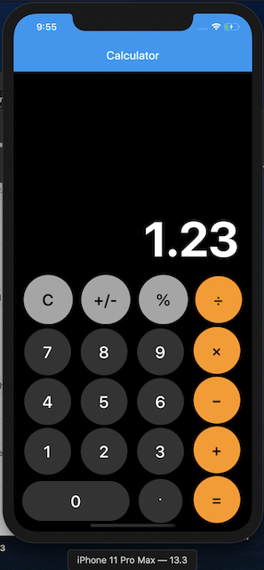

# Calculator

A simple calculator app written in Flutter.

## Features

Supports the following operations:

- Percentage
- Addition
- Subtraction
- Multiplication
- Division

The above works for both integer and floating point values.

Continuous operations are also supported i.e. you can keep using the operators to carry forward the computation without hitting equals.

## Screenshots

- iOS

- Android

